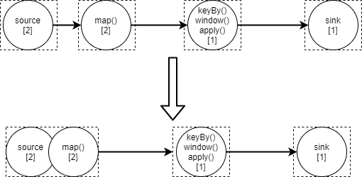

# 流处理API

## 算子


### 算子概念


### Source算子

#### KafkaSource算子


```java
KafkaSource<String> kafkaSource = KafkaSource.<String>builder()
                .setTopics("test")
                .setGroupId("test")
                .setBootstrapServers("test")
                // 设置 kafka 偏移量
                .setStartingOffsets(OffsetsInitializer.committedOffsets(OffsetResetStrategy.LATEST)) // 消费起始位移选择之前所提交的偏移量（如果没有，则重置为 LATEST）
                //.setStartingOffsets(OffsetsInitializer.earliest()) // 消费起始位移为 “最早”
                //.setStartingOffsets(OffsetsInitializer.latest()) // 消费起始位移为 “最新”
                //.setStartingOffsets(OffsetsInitializer.offsets(Map< TopicPartition, Long>)) // 消费起始位置为：方法传入的每个分区及对应的起始偏移量
                // 设置 kafka 消息反序列化器
                .setValueOnlyDeserializer(new SimpleStringSchema()) // 设置反序列化器，kafka 消息中只有 value 值
                //.setDeserializer(KafkaRecordDeserializationSchema) // 设置反序列化器，kafka 消息中既有 key 值，也有 value 值
                // 把 source 算子设置成 BOUNDED 属性（即有界流），就是读到传入参数指定的位置就停止读取并退出。
                // 常用于补数或者重跑某一段历史数据
                .setBounded(OffsetsInitializer.committedOffsets())
                // 把 source 算子设置成 UNBOUNDED 属性（即无界流），但是并不会一直读数据，而是到达参数指定位置后就停止读取，但程序不退出。
                // 主要应用场景：需要从 kafka 中读取某一段固定长度的数据，然后拿着这段数据去跟另外一个真正的无界流联合处理
                .setUnbounded(OffsetsInitializer.committedOffsets())
                // 设置 kafka 的其他属性
                //.setProperties()
                // 开启 kafka 底层消费者的自动偏移量提交机制，它会把最新的消费偏移提交到 kafka 的 consumer_offsets 中。
                // 就算开启了自动偏移里昂提交机制，KafkaSource 依然不依靠自动偏移量提交机制（宕机重启时，优先从 flink 自己的状态中获取 topic 的偏移量，因为更可靠；
                // 状态中没有的话才从 kafka 的 consumer_offsets 中拿）
                .setProperty(ConsumerConfig.ENABLE_AUTO_COMMIT_CONFIG, "true")
                .build();
```


#### 自定义Source算子


### Transformation算子

#### map算子


#### flatMap算子


#### project算子


类似 sql 中的 select


### Sink算子


#### StreamFileSink


#### KafkaSink


#### JdbcSink


#### RedisSink


### 分区算子

​	涉及到分布式存储概念的系统或者框架中常有分区概念，例如kafka、es等。它们常常把数据切割分为不同的部分存储到集群中的不同节点机器上，这样的好处显而易见：不会受单台机器存储能力的限制，利用分布式集群的水平扩展能力支持海量数据的存储。

​	flink是一个分布式计算的框架，也存在数据分区概念，但和分布式存储中的分区概念略有不同。flink会将task划分为一个或多个subtask，每个subtask处理一部分数据，从而提升计算处理能力。所以flink中的分区指的是将上游算子产生的数据发送到下游算子的哪一个subtask中。提供这种能力的算子就叫做**分区算子**。

> task和subtask的详细内容会在接下来的部分进行详细介绍


#### 分区策略


one-to-one

redistribution


## 多流转换


#### 连接流（connect）


#### 广播流（broadcast）


#### 合并流（union）


#### 关联操作（join）

类似sql中的join关键字


#### 协同分组（coGroup）


#### 侧输出流（side-ouput）


## 


# Flink架构

## 概述


## 核心概念

​	本章节介绍一些flink应用程序中的核心概念。

[Flink核心概念：job、task、taskslot等]([【深入浅出flink】第3篇：多图讲解flink核心概念（通俗易懂）Job、Task、SubTask、Slot、Slotsharing、Parallelism、Operator Chains_flink job-CSDN博客](https://blog.csdn.net/qq_37555071/article/details/122374146) )


### Job

​	Job可以表示一个独立提交给Flink运行的应用程序。通常Job是通过JobManager提交到Flink中的，所以经由JobManager提交的都是指Job，不过JobManager一次提交的可以包含多个Job。

### 算子（Operator）

​	算子是Flink提供给用户的接口，通过该接口能够对数据流进行处理。通常一个接口称为一个算子，常见算子有：map、filter、flatmap、keyBy等等。

### 算子链（Operator Chain）

​	算子链顾名思义就是将多个算子链接到一起。因为Flink是分布式流计算引擎，是运行在不同机器上的，算子与算子之间会有数据传递，数据传递过程会有一系列序列化、反序列化和网络IO等耗时操作，Flink为了提升性能，会将可以链接在一起的算子链接一起，这样他们直接的数据就可以在一个线程中传递，不需要经过以上复杂且耗费性能的操作。



disableChain startNewChain


### Task

​	Task是一个逻辑概念，一个Operator就代表一个Task（多个Operator被chain之后产生的新Operator算一个Operator）


### SubTask

​	SubTask是调度的基本单元。SubTask是Flink运行中的Task实例，Task会按照算子的并行度设置具有一个或多个SubTask，每个SubTask实例运行在不同的TaskSlot中。


## JobManager


## TaskManager

​	TaksManager简称TM，是负责真正执行flink任务的jvm进程，一个TM可以执行一个或者多个subtask

### TaskSlot

​	**TaskSlot是资源分配的基本单元。**

​	TaskSlot起到隔离TM中的资源作用，注意：**仅隔离内存资源，不隔离CPU资源**。TM中有一个或多个TaskSlot，TM将自身内存资源均分给TaskSlot，但TaskSlot之间共享CPU资源。例如：一个TM有三个TaskSlot，意味着每个TaskSlot有三分之一TaskManager内存。 

> 尽管slot并不单独分配cpu资源，我们可以通过当前taskmanger的cpu core数量来设置slot数，这样一个slot占用一个cpu core，可以更快的执行。为了更好的性能，一般cpu core数量设置为slot数，或者slot数+1


**槽位共享组（slot sharing group）**

​	为了更高效地使用资源，Flink默认允许同一个Job中不同Task的SubTask运行在同一个Slot中，这就是SlotSharing（子任务共享）。注意以下描述中的几个关键条件：

- 必须是同一个Job。这个很好理解，slot是给Job分配的资源，目的就是隔离各个Job，如果跨Job共享，但隔离就失效了；
- 必须是不同Task的Subtask。这样是为了更好的资源均衡和利用。一个计算流中（pipeline），每个Subtask的资源消耗肯定是不一样的，如果都均分slot，那必然有些资源利用率高，有些低。限制不同Task的Subtask共享可以尽量让资源占用高的和资源占用低的放一起，而不是把多个高的或多个低的放一起。比如一个计算流中，source和sink一般都是IO操作，特别是source，一般都是网络读，相比于中间的计算Operator，资源消耗并不大。相反，如果是同一个Task的Subtask放在一个slot中执行，我们就违背了并行执行的初心，放在一个slot不就是串行执行了。

默认是允许sharing的，可以通过slotSharingGroup给不同算子设置不同的共享组。关闭这个特性，不同共享组的算子一定在两个slot中。


## Flink部署模式

# 核心概念


## 时间语义


事件时间、处理时间、注入时间


## 水位线（watermark）


### 水位线生成策略


### 水位线传播

单并行度下和多并行度下的水位线传播


## 窗口（window）

Flink程序运行起来，第一个窗口的起始时间是多少？有啥规律？


### 窗口类别


### 窗口处理算子


### 窗口触发器


# Process Function

# 状态管理


## 概述


### 状态类别


# 容错机制（Fault Tolerance）


# Flink调优


# Table & SQL


